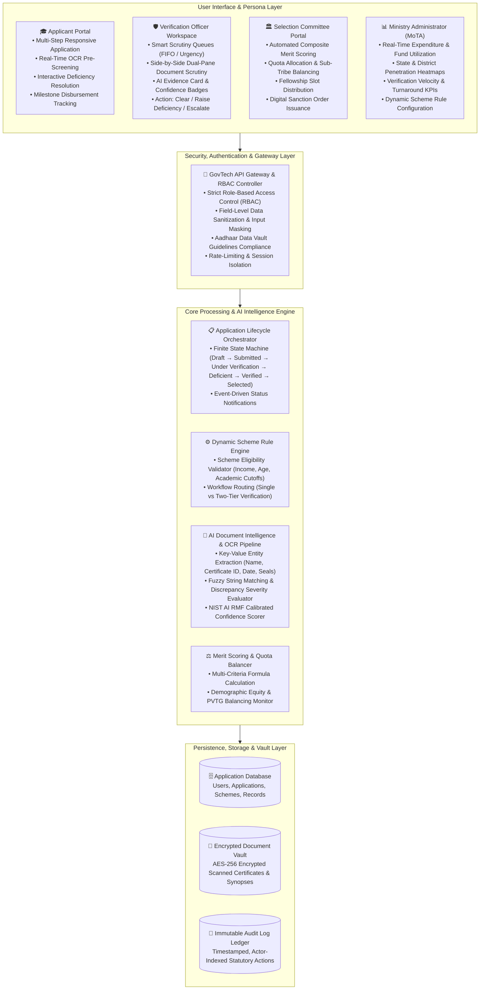
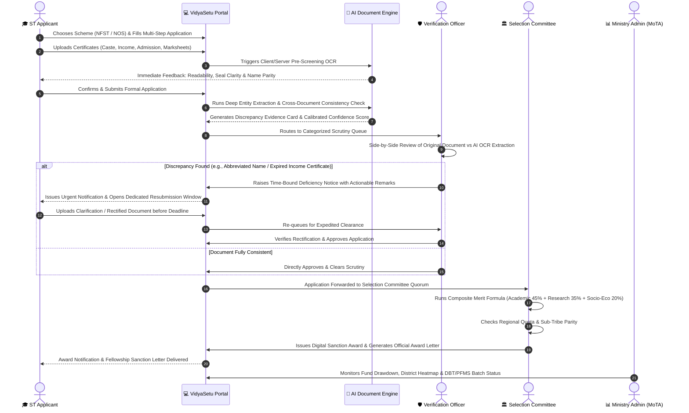

<div align="center">

# 🏛️ VidyaSetu
### Intelligent Scholarship & Fellowship Lifecycle Management Platform for Scheduled Tribes
**An AI-Augmented GovTech Solution Engineered for the Ministry of Tribal Affairs (MoTA), Government of India**

[](https://www.sih.gov.in/)
[](https://www.sih.gov.in/)
[](https://www.sih.gov.in/)
[](https://github.com/AdityaGade28/VidyaSetu)

[](https://react.dev/)
[](https://www.typescriptlang.org/)
[](https://vite.dev/)
[](https://tailwindcss.com/)
[](https://www.nist.gov/itl/ai-risk-management-framework)
[](https://opensource.org/licenses/Apache-2.0)

<p align="center">
  <b>“Applicant Applies → AI Assists → Officer Verifies → Committee Decides → Ministry Monitors”</b>
</p>

[📌 Executive Summary](#-executive-summary--hackathon-context) • [🎯 Problem Analysis](#-the-problem--ground-realities) • [💡 The VidyaSetu Solution](#-the-vidyasetu-solution) • [🌟 Core Innovations](#-core-innovations--architectural-pillars) • [🏗️ System Architecture](#️-system-architecture) • [🔄 Workflow Lifecycle](#-end-to-end-workflow-lifecycle) • [🖥️ Specialized Workspaces](#-specialized-workspaces--personas) • [🛡️ AI Governance & NIST RMF](#️-responsible-ai-governance--explainability) • [🛠️ Technical Specifications](#-technical-specifications) • [🚀 Setup & Deployment](#-getting-started--local-deployment) • [👥 Team & Credits](#-team-apex--credits)

</div>

---

## 📌 Executive Summary & Hackathon Context

| Administrative Parameter | Official Metadata |
| :--- | :--- |
| **Hackathon Initiative** | **Smart India Hackathon 2026 (SIH 2026)** |
| **Problem Statement ID** | **SIH26239** |
| **Problem Statement Title** | **AI-Enabled Scholarship and Fellowship Management System for Scheduled Tribes** |
| **Theme / Category** | **Smart Education / Software Application** |
| **Nodal Ministry** | **Ministry of Tribal Affairs (MoTA), Government of India** |
| **Target Schemes** | National Fellowship for ST (NFST), National Overseas Scholarship (NOS), Top Class Education for ST, Centrally Sponsored Post-Matric Scholarship |
| **Team ID & Name** | **133708 — Team Apex** |
| **Project Codebase** | [https://github.com/AdityaGade28/VidyaSetu](https://github.com/AdityaGade28/VidyaSetu) |

**VidyaSetu** is an enterprise-grade GovTech platform designed to bridge the operational gap between tribal scholars and higher education welfare schemes. Engineered in strict compliance with the **NIST AI Risk Management Framework (AI RMF 1.0)**, VidyaSetu transforms the scholarship lifecycle from an adversarial, document-heavy administrative bottleneck into a transparent, affirmative, and human-in-the-loop digital pathway.

---

## 🎯 The Problem & Ground Realities

Higher education welfare programs for Scheduled Tribe (ST) students—such as the **National Fellowship for Higher Education of ST Students (NFST)**, **National Overseas Scholarship (NOS)**, and **Top Class Education Scheme**—face systemic challenges across verification, scrutiny, and fund release:

1. **Fragmented Schemes & Disparate Rules**:
   Each scholarship scheme operates with distinct eligibility parameters (income ceilings from ₹2.5L to ₹8.0L, varied degree levels, institute tiers, and selection weightages). Administrative personnel struggle with disparate rules across multiple portals.

2. **Severe Manual Verification Burden**:
   Scrutiny officers manually verify thousands of high-stakes documents—caste certificates issued in varying district formats, revenue income affidavits, university admission offers, Aadhaar cards, and marksheets. This leads to fatigue, human error, and massive application backlogs lasting weeks or months.

3. **High Rejection Rates Due to Minor Discrepancies**:
   In conventional portals, applications with trivial technical mismatches (e.g., initial abbreviation *"Rahul P."* vs *"Rahul Patil"*, minor spelling variations in vernacular translation, or outdated income certificate financial years) are often rejected outright without any proactive cure window.

4. **Absence of a Closed-Loop Deficiency Mechanism**:
   When a document requires rectification, existing systems lack an interactive, time-bound query channel. Students miss critical funding opportunities simply because they are unaware of specific document flaws until the final rejection list is gazetted.

5. **Lack of Real-Time Ministry Oversight & DBT Traceability**:
   Apex authorities at the Ministry of Tribal Affairs often lack granular, real-time visibility into district-level pendency, bottleneck verification offices, demographic quota balancing, and Public Financial Management System (PFMS) Direct Benefit Transfer (DBT) readiness.

---

## 💡 The VidyaSetu Solution

VidyaSetu addresses these systemic challenges through an intelligent, empathetic, and transparent GovTech architecture:

* **Pre-Submission AI Document Guidance**: Applicants receive real-time document validation feedback *before* final submission, detecting illegible scans, expired certificates, and missing official stamps.
* **Explainable AI Document Intelligence (XAI)**: Scrutiny officers are provided with side-by-side document views featuring OCR-extracted key-value pairs, highlighted discrepancies, and calibrated confidence scores aligned with the **NIST AI Risk Management Framework**.
* **Affirmative "Detect → Notify → Cure → Re-verify" Loop**: Instead of discarding applications, officers trigger targeted Deficiency Notices with clear, standardized instructions and dedicated grace periods (10–20 days) for candidate re-upload.
* **Preserved Statutory Authority (Strict Human-in-the-Loop)**: AI never accepts, rejects, or sanctions applications autonomously. The AI layer serves exclusively as an analytical co-pilot; all legal and statutory authority remains firmly with designated Government of India officials.
* **Multi-Factor Selection & Quota Balancer**: Selection committees utilize automated composite scoring (academic merit, research aptitude, and socio-economic vulnerability) alongside real-time sub-tribe and regional representation monitoring.
* **Ministry Command & DBT Pipeline**: Apex administrators monitor end-to-end expenditure, district heatmaps, officer throughput, and PFMS payment batch readiness in real time.

---

## 🌟 Core Innovations & Architectural Pillars

```
┌─────────────────────────────────────────────────────────────────────────────────────────┐
│                                VIDYASETU CORE PILLARS                                   │
├──────────────────────────┬──────────────────────────┬───────────────────────────────────┤
│ 🧩 Multi-Scheme Engine   │ 🧠 Explainable OCR AI    │ 🔄 Proactive Deficiency Loop      │
│ Dynamic schema config    │ Key-value extraction,    │ Time-bound digital cure window    │
│ for NFST, NOS, Top-Class │ seal validation, and     │ preventing premature rejections   │
│ & Post-Matric schemes.   │ confidence scoring.      │ of deserving tribal scholars.     │
├──────────────────────────┼──────────────────────────┼───────────────────────────────────┤
│ ⚖️ Human-in-the-Loop     │ 📊 Committee Quota Balancer│ 🏛️ Ministry DBT Command Center  │
│ Strict advisory role:    │ Multi-criteria scoring,  │ District heatmaps, expenditure    │
│ AI flags, human officers │ gender parity & regional │ analytics, PFMS-ready payment     │
│ make statutory decisions.│ tribal representation.   │ batches & turnaround audit trail. │
└──────────────────────────┴──────────────────────────┴───────────────────────────────────┘
```

### 1. Dynamic Scheme Rule Engine
* Encapsulates scheme rules (academic cutoff %, parental income ceiling, eligible degree tiers, required certificate types).
* Enables Ministry admins to update guidelines, deadlines, and seat quotas without modifying underlying source code.
* Automatically enforces verification workflows: Single Officer Scrutiny for state scholarships versus Two-Tier Scrutiny for prestigious national and overseas fellowships.

### 2. High-Assurance GovTech OCR & Extraction Pipeline
* Ingests scanned PDFs, JPEG/PNG images of government-issued documents.
* Extracts critical fields: Issuing Authority, Sub-Divisional Magistrate (SDM) / Tehsildar seals, Certificate Number, Issue Date, Candidate Legal Name, and Stated Income.
* Cross-references extracted data against applicant form inputs to pinpoint exact inconsistencies with field-by-field severity rankings (*Low, Medium, High*).

### 3. Smart Deficiency Remediation Loop
* Replaces static rejections with an interactive **Deficiency Inbox** for applicants.
* Pre-built official query templates for standard issues (*Name Mismatch, Outdated Financial Year, Unclear Seal/Signature, Missing Caste Validity*).
* Dedicated timeline tracker showing days remaining before deadline expiration, maintaining an unalterable audit trail of resubmitted files.

### 4. Transparent Quota & Merit Allocation
* Normalizes scores across universities and grading systems (CGPA, SGPA, Percentage).
* Calculates composite selection scores based on configurable weights: Academic Merit (40–60%), Research Synopsis (0–35%), and Socio-Economic Vulnerability (20–60%).
* Visualizes regional diversity, ensuring equitable fellowship disbursement across Particularly Vulnerable Tribal Groups (PVTGs) and remote tribal belts.

---

## 🏗️ System Architecture

VidyaSetu utilizes a robust multi-tiered architecture structured for high reliability, data protection, and strict auditability:



---

## 🔄 End-to-End Workflow Lifecycle

The operational lifecycle follows a standardized, affirmative pathway ensuring every application is properly scrutinized without arbitrary dismissals:



---

## 🖥️ Specialized Workspaces & Personas

VidyaSetu is built around four dedicated, role-specific operational environments designed to match the real-world administrative hierarchy of government scholarship administration:

### 1. 🎓 Applicant Portal
Tailored for Scheduled Tribe students, providing an intuitive, accessible, and supportive application experience:
* **Adaptive Multi-Step Application Form**: Dynamically generates fields based on the chosen scheme (Personal Information, Tribal Community Details, Academic Background, Institutional Affiliation, Bank Account & DBT Details).
* **Real-Time OCR Pre-Screening**: Validates uploaded files immediately upon selection, alerting students if a scan is blurry, if a date has expired, or if key text is obstructed before final submission.
* **Proactive Deficiency Resolution Inbox**: Dedicated interface for viewing officer queries, reading exact remarks, and uploading replacement documents within the specified countdown timer.
* **Granular Milestone Tracker**: Visual breadcrumb status reflecting every phase: *Draft → Submitted → Under Verification → Deficient (Action Required) → Verified → Under Selection → Awarded*.

### 2. 🛡️ Verification Officer Workspace
Designed for institutional scrutiny officers and district welfare officers handling heavy document caseloads:
* **Prioritized Task Queues**: Filter applications by urgency, scheme type, pending deficiencies, and submission timestamp.
* **Dual-Pane Document Inspection Canvas**: Displays the high-resolution original document on the left and the structured AI-extracted key-value fields on the right, eliminating tedious window toggling.
* **Discrepancy Severity Highlighting**: Highlights field mismatches with clear severity categorization (*Low: minor spacing/punctuation; Medium: initials/abbreviations; High: differing legal identity or mismatched financial year*).
* **One-Click Deficiency Dispatcher**: Pre-formatted official notice templates enabling officers to raise precise queries in seconds while maintaining statutory compliance.

### 3. 🏛️ Selection Committee Portal
Engineered for fellowship selection quorums, university deans, and academic committees:
* **Composite Merit Scorecard**: Automatically computes multi-factor rankings incorporating qualifying examination percentages, NIRF institutional rank weightings, research synopsis evaluations, and socio-economic vulnerability indicators.
* **Demographic & Quota Balancing Dashboard**: Live visual tracking of allocation across sub-tribes (e.g., Gond, Bhil, Santhal, Munda, Bodo), gender ratios, and state/UT distributions to guarantee inclusive coverage.
* **Batch Sanction Order Generator**: Enables the committee to digitally authorize fellowship awards, approve waitlists, and generate digitally signed sanction letters in batches.

### 4. 📊 Ministry Admin & Analytics Command Center
Created for MoTA joint secretaries, directors, and financial advisers to exercise continuous oversight:
* **Macro Portfolio Metrics**: Real-time aggregated stats on total applications received, verification clearance velocity, pending deficiency resolution rates, and total budget allocations.
* **Geographical Distribution Heatmaps**: Interactive state- and district-level density maps displaying application counts, approval percentages, and underserved tribal pockets.
* **Financial & DBT Monitoring**: Live pipeline tracking funds committed versus disbursed, average processing turnaround times, and batch export readiness for the Public Financial Management System (PFMS).
* **Dynamic Scheme Configurator**: Administrative controls to modify scheme criteria, expand slot counts, adjust income cutoffs, and toggle application submission windows.

---

## 🛡️ Responsible AI Governance & Explainability

VidyaSetu is built in alignment with the **NIST AI Risk Management Framework (AI RMF 1.0)** core functions (**Govern, Map, Measure, Manage**):

```
       ┌────────────────────────────────────────────────────────┐
       │             NIST AI RMF GOVERNANCE IN VIDYASETU        │
       └───────────────────────────┬────────────────────────────┘
                                   │
      ┌────────────────────────────┼────────────────────────────┐
      ▼                            ▼                            ▼
┌──────────────┐             ┌──────────────┐             ┌──────────────┐
│  EXPLAINABLE │             │  HUMAN-IN-   │             │   TAMPER-    │
│  EVIDENCE    │             │  THE-LOOP    │             │   PROOF      │
│  Confidence  │             │  Zero auto-  │             │   AUDIT      │
│  scores &    │             │  rejections; │             │   Timestamped│
│  exact field │             │  statutory   │             │  actor log   │
│  mismatches. │             │  decisions   │             │  for every   │
│              │             │  by officers.│             │  decision.   │
└──────────────┘             └──────────────┘             └──────────────┘
```

1. **Zero Autonomous Adverse Decisions**:
   The AI system is strictly prohibited from autonomously denying any application or benefit. Adverse decisions (deficiencies or statutory rejections) can only be initiated by authenticated government officers with documented official remarks.

2. **Calibrated Confidence & Reason Codes**:
   Every AI extraction and matching result is tagged with a transparent confidence metric (e.g., *98.6% UIDAI Pattern Match*, *89.4% Abbreviation Match*). Officers are never shown opaque black-box classifications; they receive human-readable explanations.

3. **Demographic Fairness & Impartiality**:
   Document extraction rules operate solely on document integrity, certificate validity, and statutory criteria, preventing algorithmic bias across vernacular naming formats or regional tribal variations.

4. **Tamper-Evident Statutory Audit Trails**:
   Every state change—from initial upload to AI screening, officer queries, student counter-responses, and committee sanctions—is recorded in an immutable, actor-indexed audit log specifying timestamp, actor identity, role, and exact action details.

---

## 💻 Technical Specifications

VidyaSetu leverages a modern, robust, and accessible enterprise technology stack:

```
├── Frontend Architecture       : React 19 (Strict Mode), TypeScript 5.x
├── Build System & Bundler      : Vite 8.x with Hot Module Replacement (HMR)
├── Styling & Design System     : Tailwind CSS v4.0 (Engineered GovTech UI Tokens)
├── Micro-Interactions & Motion : Motion (Framer Motion v12)
├── Data Visualization          : Recharts 3.x (Responsive Charts, Heatmaps & Gauges)
├── Iconography & Visual Assets : Lucide React
├── AI & Document Intelligence  : Google GenAI SDK (@google/genai v2.4.0) / OCR Pipeline
├── State & Workspace Context   : React Context API with LocalStorage Persistence
└── Interoperability Alignment   : DigiLocker API Specs, PFMS Direct Benefit Transfer Schemas
```

### Key Modules & Directory Structure

```
VidyaSetu/
├── src/
│   ├── components/
│   │   ├── admin/             # Ministry Admin Command Center, Heatmaps & Scheme Config
│   │   ├── ai-intelligence/   # Deep Document OCR, Entity Extraction & Evidence Inspector
│   │   ├── applicant/         # Multi-Step Application Form, Deficiency Inbox, Tracker
│   │   ├── committee/         # Merit Scoring Matrix, Quota Balancer, Sanction Generator
│   │   ├── common/            # GovTech Buttons, Badges, Modals & Status Indicators
│   │   ├── demo/              # Interactive Guided Tour Banner & Walkthrough Controller
│   │   ├── layout/            # GovTech Navbar, Role-Aware Sidebar & Global Footer
│   │   └── officer/           # Dual-Pane Verification Canvas, Scrutiny Queue, Query Builder
│   ├── context/
│   │   └── AppContext.tsx     # Global State Management (Role switching, Applications, Schemes)
│   ├── data/
│   │   └── mockData.ts        # Comprehensive Seed Data (NFST, NOS, ST Applications, Audit Logs)
│   ├── types/
│   │   └── index.ts           # Strict TypeScript Definitions for Applications, Schemes, Logs
│   ├── App.tsx                # Core Workspace Router & Role Switcher
│   ├── main.tsx               # Application Bootstrap
│   └── index.css              # Global Tailwind CSS Styles & Custom Design Tokens
├── public/                    # Static Assets, Emblems & Government Graphics
├── index.html                 # HTML5 Entry Point with GovTech Metadata & Google Fonts
├── package.json               # Package Manifest & Script Definitions
├── tsconfig.json              # TypeScript Strict Compiler Options
└── vite.config.ts             # Vite 8 Build Configuration
```

---

## 🛠️ Feasibility, Operational Risks & Mitigation

| Operational Domain | Real-World Challenge | VidyaSetu Engineering Mitigation |
| :--- | :--- | :--- |
| **Document Degradation** | Faded physical seals, low-resolution camera scans, water damage on old caste certificates. | Multi-stage image binarization, layout analysis, and automated fallback to human officer review when confidence falls below safety thresholds. |
| **Name Variations & Vernacular Formats** | Tribal names often feature varying phonetic spellings or initial abbreviations between School Marksheets, Caste Proofs, and Aadhaar. | Fuzzy string matching with specialized initials detection (e.g., recognizing *"Rahul P."* as an abbreviation of *"Rahul Patil"* without outright rejection) paired with an evidence-backed query builder. |
| **Peak Application Concurrency** | Severe server traffic surges during the final 48 hours prior to scheme closing dates. | Client-side document pre-compression, asynchronous extraction pipelines, decoupled front-end architecture, and optimistic state updates. |
| **Data Protection & Privacy** | Sensitive citizen identity data (Aadhaar, annual income, caste affiliation). | Masked document displays (e.g., *XXXX-XXXX-4918* for Aadhaar), strict Role-Based Access Control (RBAC), and adherence to government data sovereignty norms. |

---

## 🚀 Getting Started & Local Deployment

Follow these instructions to run the VidyaSetu prototype on your local workstation.

### Prerequisites

* **Node.js**: `v20.0.0` or higher (`v22.x LTS` recommended)
* **npm**: `v10.x` or higher (or `bun` / `pnpm`)
* **Modern Web Browser**: Google Chrome, Mozilla Firefox, or Microsoft Edge

### Step-by-Step Installation

1. **Clone the Repository**:
   ```bash
   git clone https://github.com/AdityaGade28/VidyaSetu.git
   cd VidyaSetu
   ```

2. **Install Dependencies**:
   ```bash
   npm install --legacy-peer-deps
   ```

3. **Configure Environment Variables** *(Optional for live Generative AI features)*:
   ```bash
   cp .env.example .env
   ```
   *Edit `.env` and configure your API key if testing live LLM-backed intelligence:*
   ```env
   GEMINI_API_KEY=your_gemini_api_key_here
   ```

4. **Launch the Development Server**:
   ```bash
   npm run dev
   ```

5. **Access the System**:
   Open your browser and navigate to:
   ```
   http://localhost:3000
   ```

### Available NPM Scripts

| Script | Purpose |
| :--- | :--- |
| `npm run dev` | Launches the local development server on port 3000 with host binding (`0.0.0.0`) |
| `npm run build` | Compiles the production-ready optimized bundle into the `/dist` directory |
| `npm run preview` | Spins up a local static server to preview the production build |
| `npm run lint` | Executes TypeScript type-checking (`tsc --noEmit`) to verify strict type correctness |

---

## 🧭 Interactive Demonstration Guide

VidyaSetu includes a built-in **Guided Walkthrough** to demonstrate the complete GovTech lifecycle:

1. **Launch the Tour**: Click the **"Start Guided Walkthrough"** button in the top banner or select roles directly using the ribbon.
2. **Step 1 — Applicant Experience (`Applicant` Role)**:
   * View live application statuses and the **Deficiency Inbox**.
   * Inspect application `VS-2026-ST-8901` (Rahul Patil), where a caste certificate name mismatch query was raised.
   * Review the real-time countdown timer and practice resolving a deficiency notice.
3. **Step 2 — Verification Officer Scrutiny (`Verification Officer` Role)**:
   * Open the Dual-Pane Scrutiny Canvas.
   * Compare the uploaded ST Certificate alongside the OCR Extraction Card.
   * View the AI mismatch explanation: *"Initial abbreviation detected ('Rahul P.' vs 'Rahul Patil')"*.
   * Test raising a deficiency notice or clearing an eligible document.
4. **Step 3 — Merit Ranking & Selection (`Selection Committee` Role)**:
   * Inspect the automated composite merit ranking table.
   * Review sub-tribe representation metrics (Gond, Bhil, Santhal, Munda) and gender parity progress.
   * Execute batch sanction approval to generate official fellowship award letters.
5. **Step 4 — Ministry Monitoring (`Ministry Admin` Role)**:
   * Explore the nationwide disbursement KPIs and district-level enrollment heatmaps.
   * Track PFMS Direct Benefit Transfer readiness and average turnaround times.
   * Inspect scheme configuration controls for NFST and NOS.

---

## 📚 Policy, Regulatory & Technical References

1. **Ministry of Tribal Affairs (MoTA)**: Guidelines for the *National Fellowship and Scholarship for Higher Education of ST Students* and *National Overseas Scholarship Scheme for ST Candidates*.
2. **NIST AI Risk Management Framework (AI RMF 1.0)**: National Institute of Standards and Technology guidelines for trustworthy, explainable, and human-governed AI architectures.
3. **Public Financial Management System (PFMS)**: Direct Benefit Transfer (DBT) integration standards and electronic sanction mechanisms.
4. **Unique Identification Authority of India (UIDAI)**: Guidelines for Aadhaar Masking and Aadhaar Data Vault compliance.
5. **DigiLocker National API Framework**: Standard schema for machine-readable verification of educational and caste certificates.

---

## 👥 Team Apex & Credits

* **Hackathon**: Smart India Hackathon 2026 (SIH 2026)
* **Team Name**: **Team Apex**
* **Team ID**: **133708**
* **Target Ministry**: Ministry of Tribal Affairs (MoTA), Government of India

---

<div align="center">
  <sub>Developed with 🇮🇳 pride for the <b>Ministry of Tribal Affairs</b> • Smart India Hackathon 2026</sub><br/>
  <sub>Licensed under the <a href="https://opensource.org/licenses/Apache-2.0">Apache 2.0 License</a></sub>
</div>
