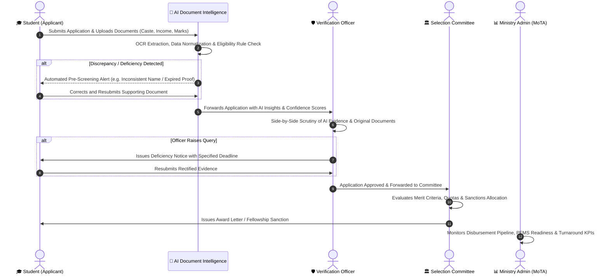

<div align="center">

# 🏛️ VidyaSetu 
### AI-Enabled Scholarship & Fellowship Management System for Scheduled Tribes
**An AI-Powered GovTech Lifecycle Solution for the Ministry of Tribal Affairs (MoTA), Government of India**

[](https://www.sih.gov.in/)
[](https://www.sih.gov.in/)
[](https://www.sih.gov.in/)
[](https://github.com/AdityaGade28/VidyaSetu)

[](https://react.dev/)
[](https://www.typescriptlang.org/)
[](https://vite.dev/)
[](https://tailwindcss.com/)
[](https://www.nist.gov/itl/ai-risk-management-framework)

<p align="center">
  <b>“Applicant Applies → AI Assists → Officer Verifies → Committee Decides → Ministry Monitors”</b>
</p>

[📌 Explore Live Prototype](http://localhost:3000/) • [📖 Technical Approach](#-technical-methodology) • [🏗️ Architecture](#️-system-architecture) • [🚀 Getting Started](#-getting-started) • [👥 Team](#-team-apex--credits)

</div>

---

## 📌 Executive Summary & Hackathon Context

| Parameter | Details |
| :--- | :--- |
| **Hackathon** | **Smart India Hackathon 2026 (SIH 2026)** |
| **Problem Statement ID** | **SIH26239** |
| **Problem Statement Title** | **AI-Enabled Scholarship and Fellowship Management System for Scheduled Tribes** |
| **Theme** | **Smart Education** |
| **PS Category** | **Software** |
| **Target Organization** | **Ministry of Tribal Affairs (MoTA), Government of India** |
| **Team ID** | **133708** |
| **Team Name** | **Team Apex** |
| **Repository** | [https://github.com/AdityaGade28/VidyaSetu](https://github.com/AdityaGade28/VidyaSetu) |

---

## 🎯 The Problem

Scholarship and fellowship disbursement processes across government departments currently face several critical bottlenecks:
* **Multiple Disjoint Schemes**: Schemes such as the *National Fellowship for ST Students (NFST)*, *National Overseas Scholarship (NOS)*, and *Pre/Post-Matric Schemes* operate under diverse eligibility criteria and distinct rule engines.
* **Extensive & Fragile Manual Verification**: Administrative staff manually scrutinize thousands of scanned marksheets, caste certificates, income affidavits, and university admission letters.
* **Administrative Delays & Backlogs**: Manual cross-checking leads to application backlogs spanning weeks or months.
* **Incomplete Applications & Silent Rejections**: In traditional portals, minor typos, initial discrepancies (e.g., *"Rahul P."* vs *"Rahul Patil"*), or outdated income certificates often result in outright rejections rather than swift remediation.
* **Lack of Real-Time Transparency**: Neither students nor ministry leaders possess comprehensive visibility into bottleneck stages or Direct Benefit Transfer (DBT) statuses.

---

## 💡 How VidyaSetu Solves It

**VidyaSetu** brings the complete scholarship and fellowship lifecycle onto a unified, intelligent GovTech platform designed with high-assurance **Human-in-the-Loop AI**:

1. **Smart Document OCR & Extraction**: Automatically extracts text, seal signatures, issue dates, issuing authorities, and roll numbers from uploaded PDFs and images.
2. **AI Eligibility Rule Engine**: Validates applicants against scheme-specific rules (income ceilings, age limits, academic cutoffs, tribal classification) in real-time.
3. **Smart Deficiency Loop**: Flags discrepancies before final submission and empowers verification officers to raise targeted, time-bound queries (*Detect → Notify → Correct → Re-verify*).
4. **Explainable AI (XAI)**: Generates human-readable evidence summaries, discrepancy confidence levels, and reason codes aligned with the **NIST AI Risk Management Framework**.
5. **Human-in-the-Loop Decision Support**: AI acts strictly as an analytical co-pilot; statutory sanctioning and rejection authority remains entirely in the hands of authorized government officials.
6. **End-to-End GovTech Transparency**: Real-time pipeline tracking for applicants and aggregated analytical dashboards for Ministry administrators (disbursement volume, district heatmaps, DBT/PFMS readiness).

---

## 🌟 Key Innovations & Uniqueness

```
┌─────────────────────────────────────────────────────────────────────────────┐
│                            VIDYASETU CORE PILLARS                           │
├──────────────────────┬──────────────────────┬───────────────────────────────┤
│ 🧩 Configurable      │ 🔍 Explainable AI    │ 🔄 Smart Deficiency           │
│    Scheme Engine     │    (NIST AI RMF)     │    Remediation Loop           │
│ Multi-scheme support │ Transparent reasons &│ Instant applicant alerts with │
│ with rules & quotas. │ confidence metrics.  │ digital resubmission window.  │
├──────────────────────┼──────────────────────┼───────────────────────────────┤
│ ⚖️ Human-in-the-Loop │ 🔒 Enterprise GovTech│ 📊 Real-Time Analytics        │
│    Verification      │    Security & RBAC   │    & Tracking                 │
│ AI assists; officers │ Granular role-based  │ Complete audit trails, DBT /  │
│ make final decisions.│ access & audit logs. │ PFMS pipeline visibility.     │
└──────────────────────┴──────────────────────┴───────────────────────────────┘
```

---

## 🏗️ System Architecture

VidyaSetu is built on a multi-tiered, service-oriented architecture ensuring high scalability, data privacy, and explainability:

```mermaid
flowchart TB
    subgraph Portals ["User Experience Layer (Role-Based Workspaces)"]
        SP["🎓 Student Portal\n• Apply for Schemes\n• Upload Certificates\n• Track Status\n• Respond to Deficiencies"]
        OP["🛡️ Verification Officer Portal\n• Queue Scrutiny\n• Side-by-Side Review\n• AI Confidence Flags\n• Raise Deficiency / Approve"]
        CP["🏛️ Selection Committee Portal\n• Merit List Ranking\n• Quota Allocation\n• Sanction Approvals\n• Fellowship Awards"]
        AP["📊 Ministry Admin Portal (MoTA)\n• Scheme Configuration\n• Expenditure & DBT Monitoring\n• District-Wise Analytics\n• Turnaround KPIs"]
    end

    subgraph Gateway ["Security & API Gateway Layer"]
        GW["🔐 API Gateway & RBAC Security\n• Role-Based Access Control\n• Request Validation & Sanitization\n• Tamper-Evident Audit Logging"]
    end

    subgraph CoreEngine ["Core Intelligence & Business Logic Layer"]
        AM["📝 Application Lifecycle Engine\n• Form Orchestration\n• Document State Machine"]
        SRE["⚙️ Scheme Rule Engine\n• Configurable Criteria (NFST, NOS)\n• Income Ceilings & Merit Rules"]
        ADI["🧠 AI Document Intelligence\n• OCR & Key-Value Extraction\n• Entity Cross-Verification\n• Mismatch & Tamper Detection"]
        AR["📈 Analytics & Reporting\n• State/District Heatmaps\n• DBT & Fund Disbursement Tracking"]
    end

    subgraph DataLayer ["Data & Persistence Layer"]
        DB[("🗄️ Application Database\nUsers, Applications, Verification Records")]
        DS[("📁 Secure Document Vault\nEncrypted Certificates & Extracted Metadata")]
        AL[("📜 Tamper-Proof Audit Logs\nTimestamped Action History")]
    end

    Portals --> Gateway
    Gateway --> CoreEngine
    CoreEngine --> DataLayer
```



---

## 🔄 End-to-End Workflow



---

## ⚖️ Comparison with Existing Systems

| Feature | Manual Process | Existing Portals | Generic AI Tools | **VidyaSetu (Our Solution)** |
| :--- | :---: | :---: | :---: | :---: |
| **Unified Multi-Scheme Platform** | ❌ Manual paper | ⚠️ Siloed portals | ❌ Disjoint | **✅ Yes (NFST, NOS, Matric, etc.)** |
| **Scheme-Specific Rule Engine** | ❌ None | ⚠️ Static / Hardcoded | ❌ Generic | **✅ Dynamic & Configurable** |
| **AI Document OCR & Extraction** | ❌ No | ⚠️ Basic OCR only | ✅ High | **✅ Tailored GovTech Document OCR** |
| **Smart Deficiency Remediation** | ❌ Days/Weeks | ⚠️ Silent rejection | ❌ None | **✅ Real-time Detect → Correct Loop** |
| **AI-Assisted Screening** | ❌ No | ⚠️ Minimal | ⚠️ Uncalibrated | **✅ Evidence-based with Confidence** |
| **Human-in-the-Loop Audit Trail** | ⚠️ Error-prone | ⚠️ Partial logs | ❌ Black-box | **✅ Explainable AI + Officer Authority** |
| **Analytics & End-to-End Tracking** | ❌ No visibility | ⚠️ Basic counts | ❌ None | **✅ Live Dashboards & DBT Pipeline** |

---

## 🖥️ Workspaces & User Personas

VidyaSetu delivers four specialized interfaces tailored to government administration workflows:

### 1. 🎓 Applicant Portal
* **Intelligent Multi-Step Form**: Dynamic fields that adapt to chosen scheme requirements (Personal, Tribal Community, Income, Academic, Bank/PFMS).
* **Instant Document Pre-Screening**: Immediate feedback on certificate validity, readability, and name match percentage before submission.
* **Deficiency Inbox**: Interactive resolution interface enabling students to address officer queries with counter-evidence within a defined grace period.

### 2. 🛡️ Verification Officer Workspace
* **Categorized Queue**: Applications categorized as *Pending*, *Under Scrutiny*, *Deficiency Raised*, *Verified*, or *Rejected*.
* **Dual-Pane Document Viewer**: Original document displayed alongside AI-extracted metadata, highlighted discrepancies, and DigiLocker cross-verification tags.
* **Evidence-Backed Query Builder**: Pre-filled templates for standard deficiencies (e.g., *Name abbreviation mismatch*, *Outdated financial year income proof*).

### 3. 🏛️ Selection Committee Portal
* **Automated Merit Ranking**: Generates merit indices combining qualifying marks, institutional tier, and scheme guidelines.
* **Quota & Reservation Balancing**: Visual tracking of gender parity, sub-tribe representations, and regional distributions.
* **Batch Sanction Approval**: Single-click digital sign-off and sanction order generation.

### 4. 📊 Ministry Admin & Analytics Dashboard
* **Macro KPI Monitoring**: Total applications, disbursement amounts, active deficiencies, and average processing turnaround times.
* **Geographical Distribution**: Interactive state- and district-level enrollment heatmaps.
* **Scheme Health Trends**: Comparative analytics between NFST, NOS, and other welfare schemes.

---

## 🛠️ Feasibility, Challenges & Mitigation

| Area | Challenge / Risk | VidyaSetu Mitigation Strategy |
| :--- | :--- | :--- |
| **Document Quality & OCR Errors** | Faded physical stamps, low-resolution scans, vernacular scripts, or handwritten marks. | Multi-pass OCR with layout analysis, confidence thresholds, and manual officer fallback for low-confidence fields. |
| **AI Hallucinations & Reliability** | Over-reliance on automated models leading to false rejections. | **Strict Human-in-the-Loop design**: AI never rejects or approves applications autonomously; it acts solely as an explanatory advisor. |
| **Data Privacy & Security** | High sensitivity of student caste, income, and identity proofs. | Role-Based Access Control (RBAC), end-to-end data encryption, and tamper-evident audit logs. |
| **Operational Scaling** | High application volume during scheme submission deadlines. | Client-side pre-processing, decoupled server architecture, and efficient caching. |

---

## 💻 Tech Stack

* **Frontend Framework**: [React 19](https://react.dev/) + [TypeScript](https://www.typescriptlang.org/)
* **Build System & Dev Server**: [Vite 8](https://vite.dev/)
* **Styling & Design System**: [Tailwind CSS v4](https://tailwindcss.com/)
* **Visualization & Analytics**: [Recharts](https://recharts.org/)
* **Icons & Micro-Interactions**: [Lucide React](https://lucide.dev/), [Motion](https://motion.dev/)
* **Document Intelligence & AI**: OCR Pipeline Architecture (PaddleOCR / Vision AI integration), NIST AI RMF Explainability
* **GovTech Interoperability**: DigiLocker API specification & PFMS (Public Financial Management System) schema compatibility

---

## 🚀 Getting Started

### Prerequisites
* **Node.js**: `v20.0.0` or higher (`v22.x` recommended)
* **npm**: `v10.x` or higher

### Installation & Local Setup

1. **Clone the Repository**:
   ```bash
   git clone https://github.com/AdityaGade28/VidyaSetu.git
   cd VidyaSetu
   ```

2. **Install Dependencies**:
   ```bash
   npm install --legacy-peer-deps
   ```

3. **Configure Environment Variables** *(Optional for AI integrations)*:
   ```bash
   cp .env.example .env
   # Add your GEMINI_API_KEY in .env if testing live generative insights
   ```

4. **Run the Development Server**:
   ```bash
   npm run dev
   ```

5. **Open in Browser**:
   Navigate to [http://localhost:3000](http://localhost:3000)

### Available Scripts

| Command | Action |
| :--- | :--- |
| `npm run dev` | Starts the Vite development server on port 3000 with host binding |
| `npm run build` | Compiles the production-ready bundle into `/dist` |
| `npm run lint` | Runs TypeScript type checking (`tsc --noEmit`) |
| `npm run preview` | Locally previews the production build |

---

## 📚 Policy & Research References

1. **Ministry of Tribal Affairs (MoTA)**: Official guidelines on ST Scholarship schemes, National Fellowship (NFST), and National Overseas Scholarship (NOS).
2. **NIST AI Risk Management Framework (AI RMF 1.0)**: Guiding principles for trustworthy, fair, explainable, and human-governed AI systems.
3. **PaddleOCR / Open-Source Document AI**: Frameworks for robust multilingual optical character recognition and structured form understanding.
4. **National Portal of India & DigiLocker**: Digital certificate verification standards and institutional data exchange models.

---

## 👥 Team Apex & Credits

* **Event**: Smart India Hackathon 2026
* **Team Name**: **Team Apex**
* **Team ID**: **133708**

---

<div align="center">
  <sub>Developed with ❤️ for the <b>Ministry of Tribal Affairs</b> • Smart India Hackathon 2026</sub>
</div>
